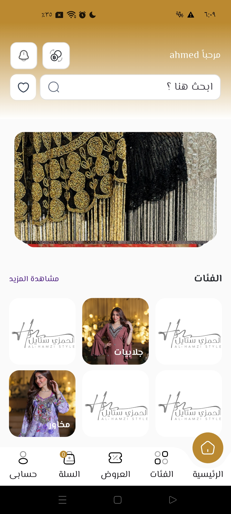
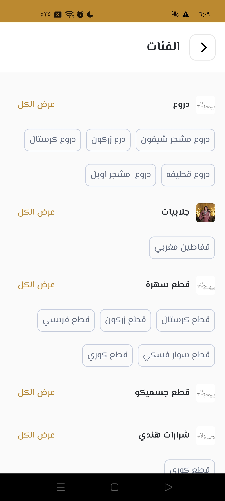
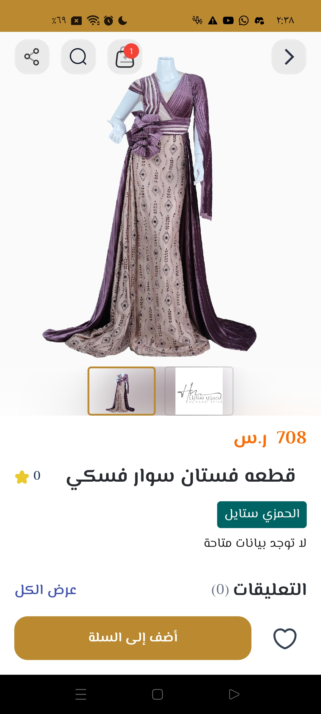
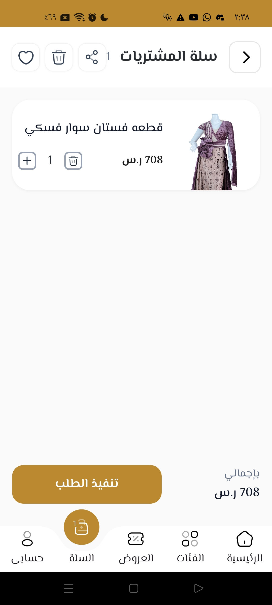
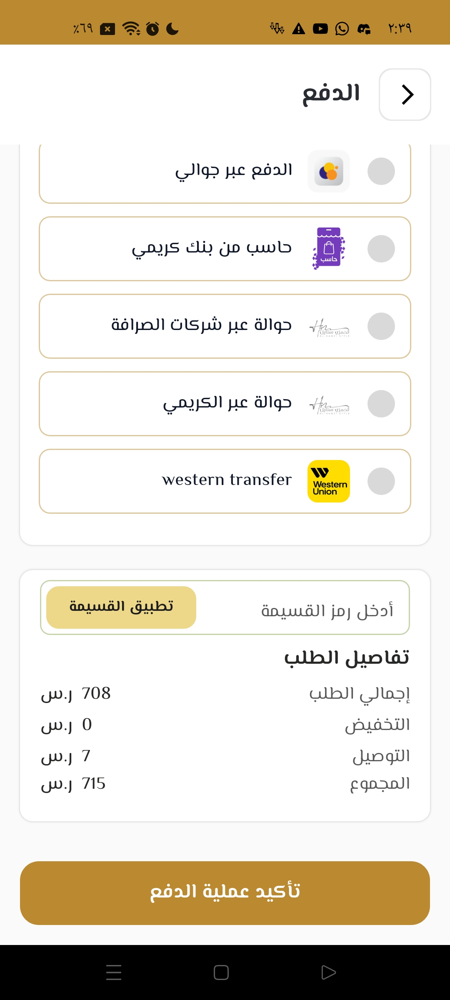
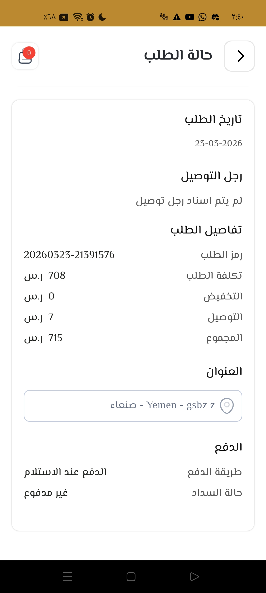

<div align="center">


# Alhamzi 👗

### High-Quality Fashion E-Commerce App

A premium fashion shopping app for high-quality dresses and clothing.  
Clean UI, smooth animations, and a seamless shopping experience from browse to checkout.

<br/>

[](https://flutter.dev)
[](https://dart.dev)
[](https://bloclibrary.dev)
[](https://restfulapi.net)
[](https://github.com/AhmeedGamil)

</div>

---

## 📸 Screenshots

<div align="center">
<table>
  <tr>
    <td align="center">
      
      <br/><sub><b>Home</b></sub>
    </td>
    <td align="center">
      
      <br/><sub><b>Categories</b></sub>
    </td>
    <td align="center">
      
      <br/><sub><b>Product Detail</b></sub>
    </td>
  </tr>
  <tr>
    <td align="center">
      
      <br/><sub><b>Cart</b></sub>
    </td>
    <td align="center">
      
      <br/><sub><b>Checkout</b></sub>
    </td>
    <td align="center">
      
      <br/><sub><b>Order Tracking</b></sub>
    </td>
  </tr>
</table>
</div>

---

## ✨ Features

- 👗 **Fashion Catalog** — High-quality dress and clothing catalog with organized categories
- 🔍 **Search & Filters** — Find products by category, price, and style
- ❤️ **Wishlist** — Save favorite items for later
- 🛒 **Cart & Checkout** — Smooth multi-step checkout with secure payment
- 📦 **Order Tracking** — Real-time order status updates
- 🔔 **Push Notifications** — Order updates and promotions
- 🎨 **Glass UI** — Custom blur and glass morphism effects
- 🎬 **Animations** — Smooth transitions and micro-interactions
- 🌐 **RTL Support** — Full Arabic right-to-left layout support

---

## 🏗️ Architecture

Feature-based Clean Architecture using the **Arctic** module system with BLoC for state management.

```
lib/
├── core/
│   ├── api/                # API client setup
│   ├── config/             # App configuration
│   ├── constants/          # App-wide constants
│   ├── database/           # Local database setup
│   ├── di/                 # Dependency injection
│   ├── error/              # Error handling & failures
│   ├── l10n/               # Localization (Arabic/English)
│   ├── network/            # Network layer & interceptors
│   ├── registry/           # Service registry
│   ├── routing/            # App navigation & routes
│   ├── storage/            # Local storage abstraction
│   ├── theme/              # Glass UI theme, colors, text styles
│   ├── usecases/           # Base usecase definitions
│   ├── utils/              # Helpers & extensions
│   └── widgets/            # Shared UI components
│
└── features/               # Each feature is fully self-contained
    ├── cart/
    │   ├── data/           # Models, repositories, datasources
    │   ├── di/             # Feature-level dependency injection
    │   ├── domain/         # Entities, usecases, abstract repos
    │   ├── presentation/   # BLoC, pages, widgets
    │   ├── cart_registry.dart
    │   └── cart.dart
    ├── products/           # Same structure
    ├── orders/             # Same structure
    ├── auth/               # Same structure
    └── ...
```

---

## 🛠️ Tech Stack

| Category | Technology |
|----------|-----------|
| Framework | Flutter 3.x |
| Language | Dart |
| State Management | BLoC + Cubit |
| Module System | Arctic |
| Architecture | Clean Architecture (Feature-based) |
| Backend | REST API |
| Local Storage | Shared Preferences + SQLite |
| UI Effects | BackdropFilter · Glass morphism |
| Animations | Flutter Animations + Hero |
| Notifications | Firebase Cloud Messaging |
| RTL | Full Arabic support |

---

## 👨‍💻 Developer

**Ahmed Gamil** — Flutter Developer & AI Systems Engineer

[](https://www.linkedin.com/in/ahmed-gamil-630980218/)

---

<div align="center">
  <sub>This repository contains screenshots and documentation only. Source code is proprietary.</sub>
</div>
